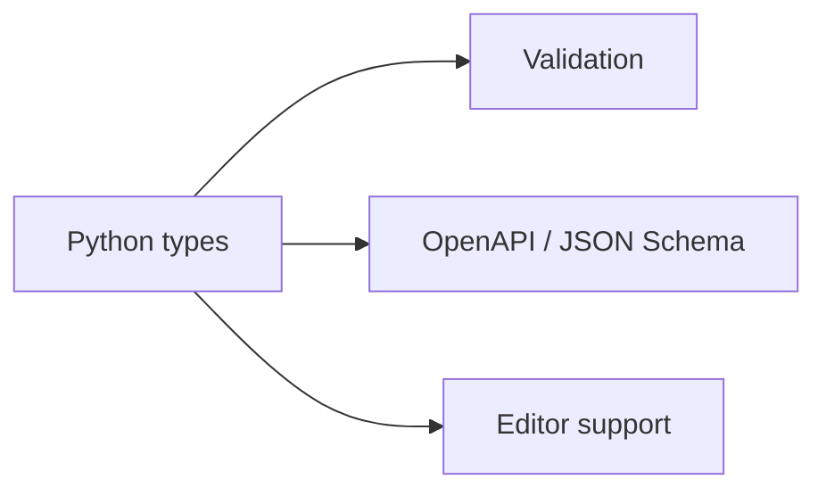
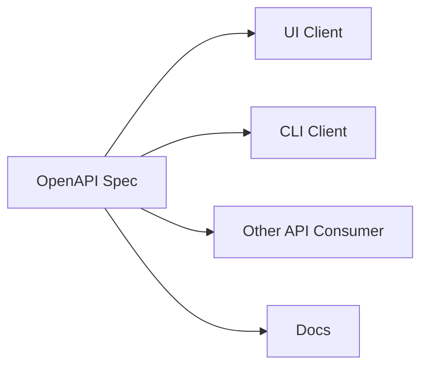

# FastAPI

Where Simplicity Meets Elegance

<!--
Welcome: goal is to show how FastAPI reduces boilerplate and uses standards you already know.
-->


---
layout: default
---
# About Me
* Names
  - Borislav Varadinov​s
* Company
  - Dell Technologies​
* Job Title​
  - Senior Principal Engineer​


---
layout: default
---

# Agenda

<v-clicks>

- Introduction & philosophy
- Types as the core idea
- First API & request handling
- Pydantic models & auto docs
- Dependency injection & errors
- Async, project structure, advanced bits
- OpenAPI metadata & summary

</v-clicks>

---
layout: section
---

# 1 · Introduction

Why FastAPI exists and what it optimizes for

---
layout: default
---

# What is FastAPI?


- **Web framework** for building APIs with Python 3.9+
- **Type hints** for clarity, better tooling, and safer code
- Built on **Starlette** (ASGI) and **Pydantic**
- **OpenAPI**: schemas and docs are a side effect of your code

<br />



<!--
FastAPI is not a full CMS like Django; it shines at JSON APIs and microservices.
-->

---
layout: default
---

# Why FastAPI? 
<v-clicks>

* High performance
* Fast to code
* Reduce human induced errors
* Great editor support 
* Easy
* Robust
* Standards-based

</v-clicks>


<div v-click class="mt-8 p-4 rounded-lg bg-teal-500/10 border border-teal-500/30">

**Core philosophy:** easy to learn, fast to code, **ready for production** — with less magic and more types.

</div>


---
layout: default
---

# Why FastAPI (cont.)?

<v-clicks>

- **Flask:** simple but leaves validation, docs, and async as DIY
- **Django:** batteries-included, heavier* for REST APIs
- **async** without sacrificing clarity and **standards**

</v-clicks>

---
layout: section
---

# 2 - REST

---
layout: two-cols
class: small-x-table
layoutClass: gap-8
---

# HTTP — bird's-eye view

::left::

### URL (what you address)

| Part | Example |
|------|---------|
| **Scheme** | `https://`  |
| **Authority** | `api.shop.example:443`  |
| **Path** | `/v1/products/42` | 
| **Query** | `?color=red&in_stock=1` | 

### Body, headers, and cookies

| Part | Example / role |
|------|----------------|
| **Body** | Payload (`JSON`, form fields, files); described by `Content-Type` |
| **Headers** | `Authorization`, `Accept`, `Content-Type`, `Cache-Control`, custom `X-*` |
| **Cookies** | `Set-Cookie` on responses; browser sends `Cookie` on later requests |

::right::

### Methods (verbs) — intent, not guarantees

| Method | Typical use | 
|--------|-------------|
| `GET` | Read / list |
| `HEAD` | Like `GET`, no body |
| `POST` | Create | 
| `PUT` | Replace whole resource |
| `PATCH` | Partial update |
| `DELETE` | Remove | 

### Status codes — families

| Range | Meaning | Examples |
|------:|---------|----------|
| **1xx** | Informational | `100` Continue |
| **2xx** | Success | `200` OK, `201` Created, `204` No Content |
| **3xx** | Redirection | `301` Moved, `302` Found, `304` Not Modified |
| **4xx** | Client error | `400` Bad Request, `401` Unauthorized, `403` Forbidden, `404` Not Found, `409` Conflict, `422` Unprocessable |
| **5xx** | Server error | `500` Internal, `502` Bad Gateway, `503` Unavailable |

<style>
.small-x-table table {
  font-size: 0.7rem;
  line-height: 1.25;
}
.small-x-table th,
.small-x-table td {
  padding: 0.15rem 0.35rem;
}
.small-x-table h3 {
  font-size: 0.85rem;
  margin-top: 0.5rem;
  margin-bottom: 0.35rem;
}
.small-x-table h3:first-child {
  margin-top: 0;
}
</style>

---
layout: default
---

# REST Overview

<v-clicks>

- Representational State Transfer
- Architectural **style** (not a framework)
- Usually **HTTP** + **JSON**
- **Representations** of state (e.g. JSON document)
- **Resources** - **URLs**, **paths** and **query params**
- **Methods** express actions
- **Stateless** - Each request should carry what the server needs
- **status codes** & **headers**

</v-clicks>

---
layout: default
---

# REST Examples

Same **resource** (`items`), three intents — **path**, **query**, **body**:

<v-clicks>

**GET** — path segment + query string

```http
GET /items/42?in_stock=true HTTP/1.1
```

**POST** — create a new item (JSON body)

```http
POST /items HTTP/1.1

{ "name": "Mug", "price": 9.99 }
```

**PATCH** — update part of an item

```http
PATCH /items/42 HTTP/1.1

{ "price": 8.99 }
```

</v-clicks>

---
layout: section
---

# 3 - OpenAPI

---
layout: two-cols
---

# OpenAPI Spec (OAS)

**OpenAPI document defines:**

::left::
- Schema
- Data Format
- Data Type
- Path
- Object

::right::

<div class="flex h-full items-center justify-center pr-4">


</div>

---
layout: default
class: slide-openapi-example
---

# OpenAPI Spec Example
```json
{
  "openapi": "3.0.0",
  "info": { "title": "Example API", "version": "1.0.0" },
  "paths": {
    "/users/{user_id}": {
      "get": {
        "parameters": [
          {
            "name": "user_id",
            "in": "path",
            "required": true,
            "schema": { "type": "integer" }
          }
        ],
        "responses": {
          "200": {
            "description": "A user",
            "content": {
              "application/json": {
                "schema": {
                  "type": "object",
                  "properties": {
                    "id": { "type": "integer" },
                    "email": { "type": "string", "format": "email" }
                  }
                }
              }
            }
          }
        }
      }
    }
  }
}
```

<style>
.slide-openapi-example pre.shiki,
.slide-openapi-example pre.shiki code {
  font-size: 10px !important;
  line-height: 1.2 !important;
}
</style>

---
layout: default
---

# Why OpenAPI?



---
layout: section
---

# 2 · Types everywhere

Simplicity through standard Python type hints

---
layout: default
---

# Python type hints
<v-clicks>

* Optional labels on parameters, return values, and variables
* Not runtime checks by default
* Example

````md magic-move {lines: true }
```python {*}
def count_words(text):
    words = text.split()
    result = {}
    
    for word in words:
        result[word] = result.get(word, 0) + 1
    
    return result
```

```python {*}
def count_words(text: str) -> dict[str, int]:
    words = text.split()
    result: dict[str, int] = {}
    
    for word in words:
        result[word] = result.get(word, 0) + 1
    
    return result
```
````
- **Why they exists?** 
  - IDEs 
  - Static checkers
  - Modern libraries and frameworks
</v-clicks>


<!--
Type hints are optional at runtime (PEP 484+); FastAPI reads them for validation and OpenAPI.
-->


---
layout: default
---

# Type hints = contract

- No custom DSL — **plain `typing`**
- Parameters and return types drive parsing and validation
- **IDEs** autocomplete routes, models, and errors

```python
def greet(name: str) -> str:
    return f"Hello, {name}"
```

<div class="text-sm opacity-80 mt-2">

Same idea at scale: path, query, body, headers — all typed.

</div>

---
layout: default
---

# Pydantic

* Library used for
  * Data validation 
  * Serialization 
  * Deserialization

* Why Pydantic
  * Validate incoming data (e.g., APIs, Databases)
  * Catch errors early
  * Work cleanly with typing


---
layout: default
---

# Pydantic (Example)

````md magic-move {lines: true }
```python {1|3|4|5|6|*}
from pydantic import BaseModel

class Book(BaseModel):
  name: str
  price: float
```
```python {7-9}
from pydantic import BaseModel

class Book(BaseModel):
  name: str
  price: float

json_data = '{"name": "Brave New World", "price": 13.2}'

book = Book.model_validate_json(json_data)
```
````

<v-clicks>

- **`BaseModel`** - define shapes with normal Python types
- **Validation** - invalid data raises clear errors
- **JSON-friendly** - parse and serialize dicts / JSON
- **Schema for free** - each model maps to **JSON Schema**

</v-clicks>

---
layout: default
---

# Pydantic (Field Example)

````md magic-move {lines: true }
```python {*}
from pydantic import BaseModel

class Book(BaseModel):
  name: str
  price: float
  tags: list[str]
```
```python {*}
from pydantic import BaseModel, Field

class Book(BaseModel):
  name: str = Field(min_length=1, max_length=200)
  price: float = Field(gt=0, description="Price in USD")
  tags: list[str] = Field(default_factory=list)
```
````

<v-clicks>

- **`Field`** — constraints beyond the type: `gt` / `lt`, `min_length` / `max_length`, regex, and more
- **`default` or `default_factory`** — Default options
- **`description`** — ends up in **JSON Schema**
- **Errors stay structured** — validations report which field failed and why

</v-clicks>

---
layout: default
---

# Pydantic (Nested Example)

````md magic-move {lines: true }
```python {*}
from pydantic import BaseModel

class Book(BaseModel):
  name: str
  price: float

```
```python {7-9|*}
from pydantic import BaseModel

class Book(BaseModel):
  name: str
  price: float

class User(BaseModel):
  email: str
  books: list[Book] = Field(default_factory=list)
```
````


---
layout: section
---

# 3 · Your first API

Minimal code, automatic responses

---
layout: default
---

# Install FastAPI

* pip 

```bash
pip install "fastapi[standard]"
```

* uv

```bash
uv add "fastapi[standard]"
```

<div v-click class="mt-8 p-4 rounded-lg bg-teal-500/10 border border-teal-500/30">

**Python Virtual Environment (venv):** always create venv for your projects

</div>


---
layout: default
---

# Hello, FastAPI

```python {1|3|5|6|7|all}
from fastapi import FastAPI

app = FastAPI()

@app.get("/")
def read_root():
    return {"message": "Hello World"}
```

<v-clicks>

- `FastAPI()` — ASGI app
- `@app.get("/")` — **path operation** (HTTP GET)
- Return a **dict** → JSON response with correct `Content-Type`

</v-clicks>

---
layout: default
---

# FastAPI and Types

```python {all}
from fastapi import FastAPI, HTTPException
from pydantic import BaseModel

app = FastAPI()

class Book(BaseModel):
  name: str
  price: float

books = [
  Book(name="Brave New World", price=13.2),
  Book(name="1984", price=15.8),
]

@app.get("/books/{book_id}", response_model=Book)
def get_book(book_id: int):
    if not 0 <= book_id < len(books):
        raise HTTPException(status_code=404, detail="Book not found")
    return books[book_id]

@app.get("/books", response_model=list[Book])
def list_books():
    return books
```

---
layout: default
---

# FastAPI (run)

```bash
uvicorn main:app --reload
```

`main` = your file name without `.py`; `app` = the `FastAPI()` instance.


---
layout: two-cols-header
---

# FastAPI vs Flask
::left::
<div class="mr-4">

```python {all}
from fastapi import FastAPI, HTTPException
from pydantic import BaseModel

app = FastAPI()

class Book(BaseModel):
  name: str
  price: float

books = [Book(name="1984", price=15.8)]

@app.get("/books/{book_id}", response_model=Book)
def get_book(book_id: int):
    return books[book_id]

@app.get("/books", response_model=list[Book])
def list_books():
    return books
```

</div>

::right::
```python {all}
from flask import Flask, jsonify, abort

app = Flask(__name__)

books = [{"name": "Brave New World", "price": 13.2}]

@app.route("/books/<int:book_id>", methods=["GET"])
def get_book(book_id):
    return jsonify(books[book_id])

@app.route("/books", methods=["GET"])
def list_books():
    return jsonify(books)
```

---
layout: section
---

# 4 · Request handling

Path, query, and body — parsed for you

---
layout: default
---

# Parameters

* Path

```python
@app.get("/items/{item_id}")
def read_item(item_id: int):
    return {"id": item_id}
```

* Query

```python
@app.get("/search")
def search(q: str, limit: int = 10):
    return {"q": q, "limit": limit}
```

* Body

```python
...
class Item(BaseModel):
    name: str
    price: float

@app.post("/items")
def create_item(item: Item):
    return item
```


---
layout: section
---

# 5 · Automatic API docs

The “wow” moment

---
layout: default
---

# Swagger & ReDoc

- **`/docs`** — Swagger UI (try it out)
- **`/redoc`** — ReDoc (readable reference)
- Generated from **OpenAPI 3** + **JSON Schema**

<br />
<div class="text-lg space-y-4">

| **What you skip** | **What you get** |
|---------------|----------------|
| Hand-written OpenAPI | Live spec |
| Example payloads | From models |
| Try-request UI | Built-in |

</div>

<div class="mt-6 p-3 rounded bg-amber-500/10 border border-amber-500/30 text-sm">

👉 Docs are not an afterthought — they stay in sync with code.

</div>

---
layout: section
---

# 7 · Dependency injection

`Depends()` for clean architecture

---
layout: default
---

# Reusable dependencies

```python {1|3-8|9|all}
from fastapi import Depends, FastAPI

app = FastAPI()

def get_settings():
    return {"api_key": "..."}

@app.get("/secure")
def secure(data: dict = Depends(get_settings)):
    return {"configured": bool(data.get("api_key"))}
```

<v-clicks>

- **`Depends(callable)`** runs per request; result injected into the route
- Perfect for **DB sessions**, **auth**, **config**, shared validation
- Easy to **override in tests** by swapping dependencies

</v-clicks>

---
layout: section
---

# 8 · Validation & errors

Less surprise at runtime

---
layout: two-cols-header
---

# Built-in Validation (Pydantic)

- Request data validation (using the types and **`Field(...)`** constraints)
- **422 Unprocessable Entity** if validation fail

::left::
<div class="mr-4">

**Model + route**

```python
from fastapi import FastAPI
from pydantic import BaseModel, Field

app = FastAPI()

class Item(BaseModel):
    name: str = Field(min_length=1, max_length=100)
    price: float = Field(gt=0)

@app.post("/items")
def create_item(item: Item):
    return item
```
</div>

::right::

**Bad body** `POST /items`

```json
{ "name": "Brave New World", "price": -5 }
```

**442 Response** (`detail` is a list of errors):

```json
{
  "detail": [
    {
      "type": "greater_than",
      "loc": ["body", "price"],
      "msg": "Input should be greater than 0",
      "input": -5
    }
  ]
}
```

---
layout: two-cols-header
---

# Custom Validation (HTTPException)
- Request data validation using HTTP Exception + HTTP Status code (e.g. 404)

<br />

::left::

<div class="mr-4">

```python
from fastapi import FastAPI, HTTPException

app = FastAPI()

ALLOWED_IDS = {1, 2, 3}

@app.get("/items/{item_id}")
def get_item(item_id: int):
    if item_id not in ALLOWED_IDS:
        raise HTTPException(
            status_code=404,
            detail="Item not found",
        )
    return {"id": item_id}
```

</div>

::right::

**`GET /items/99`** → **`404 Not Found`**

```json
{
  "detail": "Item not found"
}
```

---
layout: section
---

# 9 · Async support

`async` / `await`, I/O vs CPU, and FastAPI + SQLAlchemy

---
layout: default
---

# What is asynchronous programming?

<v-clicks>

- **Cooperative concurrency** 
  * While one task **waits** (network, disk, DB), it can give the control back to the runtime
- **`async def`** defines a **coroutine**
- **`await`** pauses *this* coroutine until the awaited operation finishes
- Good fit for **waiting on I/O**

</v-clicks>

---
layout: default
---

# I/O-bound vs CPU-bound

| | **I/O-bound** | **CPU-bound** |
|--|--|--|
| **What** | Waiting on network, database, filesystem, remote APIs | Heavy computation (loops, parsing huge blobs, crypto, ML inference on CPU) |
| **`async/await`** | Often helps — overlap waits, serve more concurrent requests | **Does not speed up** the math; the GIL / one core still limits you |
| **What to do** | `async def` + async clients (HTTP, DB drivers that support it) | **Threads**, **processes**, or **offload** to a worker / job queue |

<v-click>

Async is about **not sitting idle** while I/O completes — not about making tight loops faster.

</v-click>

---
layout: default
---

# FastAPI specifics

<v-clicks>

- **ASGI + Starlette:** built for **async** request handling
- You may use **`def`** or **`async def`** for path operations 
- FastAPI runs **sync** functions in a **thread pool** 
- Prefer **`async def`** when the route **`await`s** async I/O 
- Avoid **blocking** calls (huge CPU work) **inside** `async def`

</v-clicks>

<div v-click class="mt-4 text-sm opacity-90">

Typing, OpenAPI, and validation work the **same** for `def` and `async def`.

</div>

---
layout: default
---

# Example: SQLAlchemy async `select`

```python
from fastapi import FastAPI
from sqlalchemy import select
from sqlalchemy.ext.asyncio import AsyncSession

app = FastAPI()

# `User` = your ORM model (table mapping not shown)

@app.get("/users/{user_id}")
async def read_user(user_id: int, session: AsyncSession):
    result = await session.execute(
        select(User).where(User.id == user_id),
    )
    return result.scalar_one_or_none()
```

<div class="text-sm opacity-80 mt-2">

`await session.execute(...)` yields while the DB driver waits — other requests can progress on the same loop.

</div>

---
layout: section
---

# 10 · Real project

---
layout: default
---

# Project Structure
```bash
fastapi-project/
├── app/
│   ├── main.py                # Entry point
│   ├── api/                  # API layer
│   │   ├── router.py     # Main router
│   │   └── endpoints/
│   │       ├── users.py
│   │       └── items.py
│   ├── models/               # Database models (ORM)
│   │   └── user.py
│   ├── schemas/              # Pydantic schemas
│   │   └── user.py
│   ├── services/             # Business logic layer
│   │   └── user_service.py
│   └── utils/                # Utilities/helpers
│       └── common.py
├── tests/                   # Tests
│   ├── test_users.py
│   └── conftest.py
├── .env
├── alembic.ini
├── pyproject.toml / requirements.txt
└── README.md
```


---
layout: default
---

# `APIRouter` + packages

```python
# routes_items.py
from fastapi import APIRouter

router = APIRouter(prefix="/items", tags=["items"])

@router.get("/")
def list_items():
    return []
```

```python
# main.py
from fastapi import FastAPI
from app.api.routes_items import router as items_router

app = FastAPI()
app.include_router(items_router)
```

<v-clicks>

- **Separation of concerns**: each router owns a slice of URLs
- **`tags`** group endpoints in OpenAPI UIs

</v-clicks>


---
layout: default
---

# Tie it together

<v-clicks>

- **Less boilerplate**
- **Types** → validation + docs + **contracts** with clients
- **Standards** — OpenAPI & JSON Schema, not a bespoke stack
- **Simplicity** → fewer moving parts, fewer bugs
- **Elegance** → Types, Pydantic, DI, routers
- **Productivity** → ship APIs faster with live docs

</v-clicks>